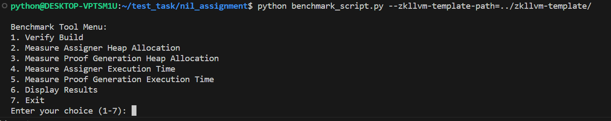
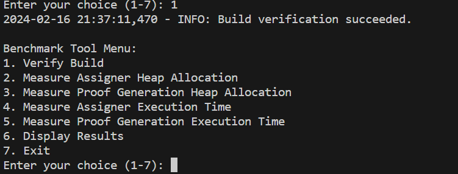
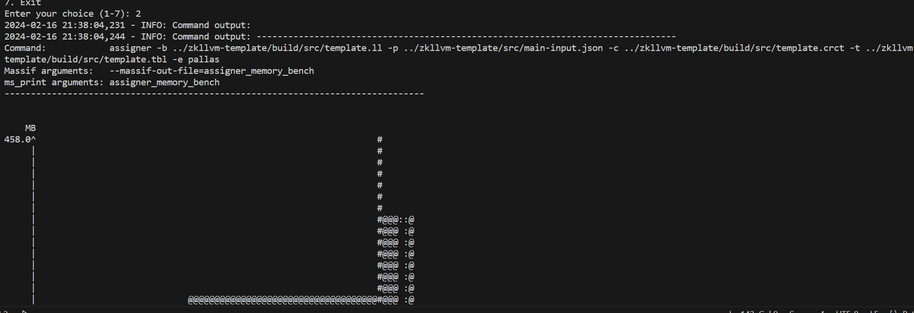
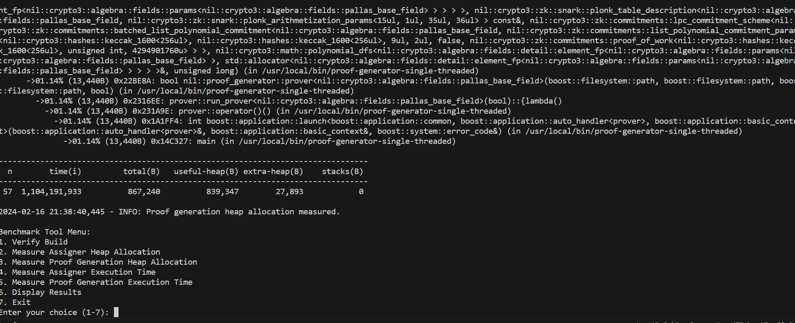
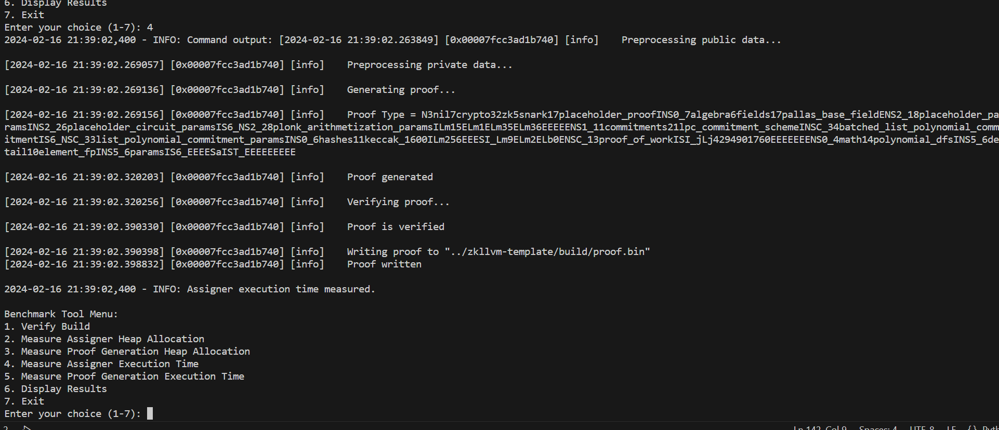
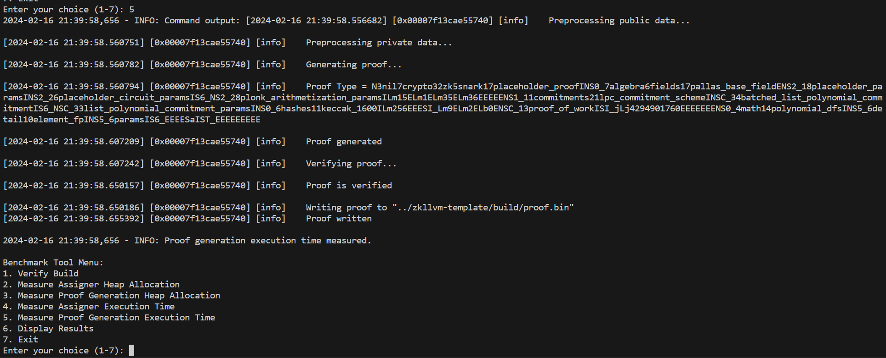
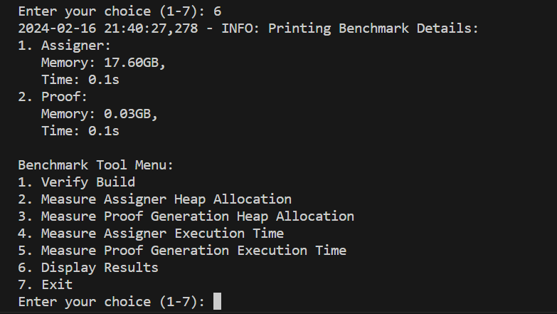

# Nil Homework assignment

## Introduction
This repository contains a benchmarking tool designed for the Nil Foundation's assignment, focusing on memory and time benchmarks for zero-knowledge circuit operations. It automates the evaluation of circuit compilation and proof generation processes, targeting Linux x86 systems. The tool benchmarks heap allocation and execution time, essential for optimizing zero-knowledge proofs.

The process includes compiling zero-knowledge circuits, measuring memory usage with Valgrind, and calculating execution times. This tool is aimed at developers and researchers working with zero-knowledge proofs, specifically within the Nil Foundation's zk-SNARKs toolkit.

For detailed assignment instructions, see the [Homework Task](readme_files/QA%20test%20assignment.md).

## Prerequisites
Before running the benchmarking tool, ensure your system meets the following prerequisites:

- **Python Version** - Ensure you have Python 3.10 or higher installed. You can check your Python version by running `python --version` or `python3 --version` in your terminal.

- **System Requirements** - The script is designed to run commands for a Linux x86 system. It is also compatible with the Windows Subsystem for Linux (WSL) for users on Windows.

- **Dependencies** - Install all necessary Python dependencies by executing the following command in your terminal:
    ```bash
    pip install -r requirements.txt
    ```


- **Additional Setup**: Refer to the [Homework Task](readme_files/QA%20test%20assignment.md) document for instructions on installing other required components and setting up your environment properly.

## Usage
To utilize the benchmarking tool, execute the script with the following command pattern:
```bash
python benchmark_script.py --zkllvm-template-path=<path_to_zkllvm_template>
```
Example:
```bash
python benchmark_script.py --zkllvm-template-path="../zkllvm-template"
```
Upon successful launch, the tool presents an interactive menu with various benchmarking operations:
{

"Benchmark Tool Menu":
1. "Verify Build"
2. "Measure Assigner Heap Allocation"
3. "Measure Proof Generation Heap Allocation"
4. "Measure Assigner Execution Time"
5. "Measure Proof Generation Execution Time"
6. "Display Results"
7. "Exit"

}
### Displaying Results
To view benchmark results, initiate options **2** through **5** from the menu to accumulate necessary data. These options correspond to distinct measurements, gathering four pivotal indicators: memory usage and execution time for both the assigner and proof generator.

### Example:
"Enter your choice (1-7):" 6


"2024-02-16 20:32:23,536 - INFO: Printing Benchmark Details:"
1. "Assigner:"<br>
   "Memory: 17.60GB,"<br>
   "Time: 0.12s"<br>
2. "Proof:"<br>
   "Memory: 0.03GB,"<br>
   "Time: 0.15s"<br><br>

- **Memory** metrics are compiled from heap memory measurements, parsed using regex in a pandas table, with sums calculated from the total(B) column and converted to GB.
### Example of sum for all measured tables:
    ```cpp
    --------------------------------------------------------------------------------
      n        time(i)         total(B)   useful-heap(B) extra-heap(B)    stacks(B)
    --------------------------------------------------------------------------------
     67     80,600,002          153,464          152,036         1,428            0|    
     Total    41165003269       35162448         33789868       1372580           0         

- **Execution times** are validated by parsing the elapsed time from command outputs, converting these values to total seconds for both the assigner and proof generator.
```cpp
real    0m0.106s
user    0m0.106s
sys     0m0.000s
```

## Manual Benchmarking Process
To manually reproduce the benchmarking process, follow the commands outlined below, executed within the `zkllvm-template` repository. This process allows for detailed analysis of both memory allocation and execution time for the assigner and proof generation phases.

### Assigner Benchmarking

1. **Memory Benchmarking with Valgrind:**
   Run the following command to measure heap allocation for the assigner:
   ```bash
   valgrind --massif-out-file=assigner_memory_bench --tool=massif assigner -b build/src/template.ll -p ./src/main-input.json -t build/src/template.tbl -c build/src/template.crct -e pallas
   ```
    This command generates a report in the file assigner_memory_bench, which can be viewed with:

    ```bash 
    ms_print assigner_memory_bench
    ```
2. **Execution Time Measurement:**
    Use the time command to measure execution time:
    ```bash
    time assigner -b build/src/template.ll -p ./src/main-input.json -t build/src/template.tbl -c build/src/template.crct -e pallas   
    ```

## Proof Generation Benchmarking

1. **Memory Benchmarking with Valgrind:**
For proof generation, execute the following command to track memory usage:

   ```bash
   valgrind --massif-out-file=proof_memory_bench --tool=massif proof-generator-single-threaded --circuit build/template.crct --assignment build/src/template.tbl --proof ./src/proof.bin

   ```
    This command generates a report in the file assigner_memory_bench, which can be viewed with:

    ```bash 
    ms_print proof_memory_bench
    ```
2. **Execution Time Measurement:**
    Use the time command to measure execution time:
    ```bash
    time proof-generator-single-threaded --circuit build/template.crct --assignment build/template.tbl --proof ./src/proof.bin
    ```
    This command generates a proof file named **proof.bin**.

## Execution Screenshots
###Main Menu:

### 1. Verify Build:

### 2. Measure Assigner Heap Allocation:

### 3. Measure Proof Generation Heap Allocation:

### 4. Measure Assigner Execution Time:

### 5. Measure Proof Generation Execution Time:

### 6. Display Results:

### 7. Exit:


## Error Handling
Understanding and resolving common errors can significantly improve your experience with the benchmarking tool. Here are some of the most frequent issues you might encounter, along with advice on how to address them:

### "Missing zkllvm-template Repository or Build Files"
If the script cannot locate the `zkllvm-template` repository or its compiled files, it will display an error message similar to the following:
```plaintext
python benchmark_script.py
2024-02-16 21:21:43,291 - ERROR: Missing required build files: template.ll, template.crct, template.tbl
2024-02-16 21:21:43,291 - ERROR: Build verification failed. Please ensure the zkllvm-template is correctly built before proceeding. 
```
**Solution:** Verify that the zkllvm-template repository is correctly cloned and built. Ensure that the template.ll, template.crct, and template.tbl files are present in the expected directory.


### "Mandatory Argument Missing"
Attempting to run the script without the mandatory --zkllvm-template-path argument or with unrecognized arguments will result in an error message like this:

```plaintext
python@DESKTOP-VPTSM1U:~/test_task/nil_assignment$ python benchmark_script.py test1
usage: benchmark_script.py [-h] [--zkllvm-template-path ZKLLVM_TEMPLATE_PATH]
benchmark_script.py: error: unrecognized arguments: test1
```
**Solution:** Make sure to include the --zkllvm-template-path argument followed by the correct path to the zkllvm-template directory when running the script. Review the command syntax to ensure it matches the expected format.


### Viewing Benchmark Results Without Execution
Trying to display benchmark results without first executing the benchmarking commands properly will lead to an error indicating incomplete results:

```plaintext
Enter your choice (1-7): 6
2024-02-16 21:24:10,815 - INFO: Printing Benchmark Details:
2024-02-16 21:24:10,815 - ERROR: Benchmark results are incomplete. Please run the benchmark first.
```
**Solution:** Ensure that you have executed options 2 through 5 from the benchmark tool menu to gather the necessary data before attempting to display the results with option 6.


## Areas for Improvement

While the following benchmarking script provides a solid foundation for evaluating zk-SNARK compilation and proof generation, several areas can be enhanced to improve usability and functionality:

- **Parallel Execution** - Implementing parallel processing for independent tasks could significantly reduce the overall benchmarking time.
- **User Interface Enhancement** - Incorporating a graphical user interface (GUI) or a more interactive command-line interface could make the tool more accessible to users unfamiliar with command-line operations.
- **Extended Error Handling and Validation** - Adding more comprehensive error checks and validations for user inputs and system configurations can prevent common pitfalls and guide users more effectively.
- **Customization and Configuration Options** - Allowing users to customize benchmark parameters and configurations through a configuration file or command-line arguments could cater to advanced use cases.

## Notes

- The tool requires a Linux x86 system or a system with Windows Subsystem for Linux (WSL) to operate correctly. Compatibility with other environments has not been tested.
- The accuracy of memory usage and execution time measurements might vary based on system load and specifications. It's recommended to run benchmarks under similar system conditions for consistent results.
- Ensure that all dependencies, especially those related to the `zkllvm-template` and its environment, are correctly installed and configured before initiating the benchmarking process.

## Considerations

- **System Load** - Running other applications and processes on the benchmarking system can influence the performance metrics captured. For the most accurate results, minimize background processes during benchmarking.
- **Path Dependencies** - The correct functioning of the tool heavily relies on the accurate specification of paths to the `zkllvm-template` and its related files. Ensure paths are correctly set to avoid errors.
- **Version Compatibility** - The tool has been developed and tested with specific versions of dependencies (e.g., Python 3.10+). Using significantly different versions may lead to unexpected results or errors.
- **Security Implications** - Running benchmarking tools, especially those executing commands and scripts, carries inherent security risks. Always verify the source code and understand the actions performed by the tool before execution.
